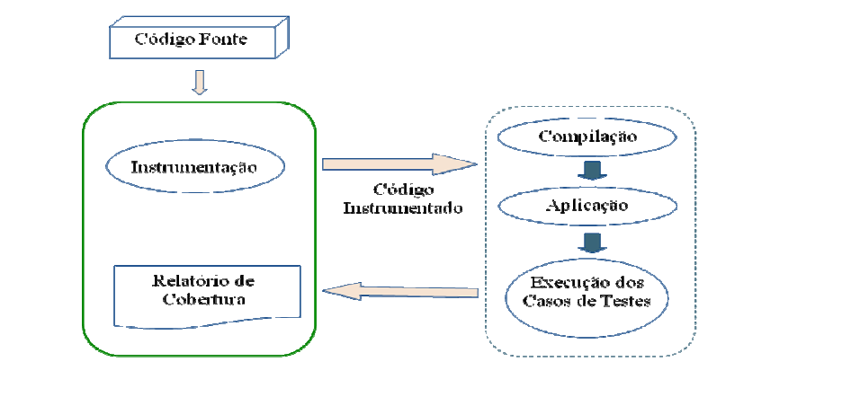
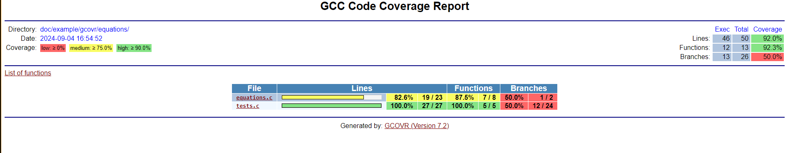

# Revisão

## DCCC analysis

### Componentes

Para entendermos do que se trata **DC(*Data Coupling*)** e **CC(*Control Coupling*)** e como , antes é preciso compreender o conceito de componente em um software. Os componentes de um sistema devem derivar, ou abranger, uma arquitetura de software e requisitos de baixo-nível(*low-level*). Não necessariamente cada implementação de um requisito de baixo nível resulta em um componente do sistema, o que é importante saber é que trata-se de uma abstração para partes do código que, quando executado, seu resultado contribuirá para a execução de uma funcionalidade do sistema.Para sistemas orientados a objeto, componentes são os métodos de uma classe.

Então, a componentização de uma funcionalidade está na divisão de um bloco grande de código, que representa uma determinada funcionalidade do software(que contém um requisito atrelado), em outros pequenos blocos, que por sua vez, quando executados, compõem uma parcela de importância para aquela funcionalidade. Essas divisões, chamadas de componentes, ajudam no momento dos testes do software para melhor identificação de erros quando há ocorrência de falta.

#### Componentes integrados

Componentes integrados são componentes que, de alguma forma dependem ou são dependências de outros componentes, esses casos são chamados de *coupling*(acoplamento).

---------------

### Verificação de acoplamento

Com o conceito de componente já apresentado, podemos adentrar na verificação dos acoplamentos entre componentes em um software. A análise de **DCCC** ajuda na demonstração de interações entre componentes, sejam elas intencionais, ou não. Para que uma cobertura de DCCC seja feita de forma mais precisa, os testes baseados em requisitos precisam fazer parte da análise.
Considerações sobre DCCC na DO-178C:

- A cobertura de de testes da estrutura do software(feita pelo DCCC) precisa ser alcançada para softwares DAL A/B/C.
- A análise deve confirmar a presença de acoplamentos entre os componentes.
- É requerido que os testes baseados em requisitos exercitem os acoplamentos.
- A análise de cobertura deve apontar interfaces que não foram exercidas durante os testes, ou seja, deficiências em casos de teste baseado em requisitos, inadequações de requisitos de software, código estranho(incluindo código morto e desativado).
- A intenção por trás da análise é garantir a suficiência dos testes.

Sem mais segredos, podemos finalmente classificar do que se trata os acoplamentos citados, e como eles são classificados.

#### DC(*Data Coupling*)

*Data Coupling* é o caso de acoplamento entre componentes via dependência de um dado. Ou seja, um componente X, que depende de um dado proveniente de um componente Y, contempla um caso de *data coupling*

#### CC(*Control Coupling*)

*Control Coupling* é o caso de acoplamento na qual um componente sofre alterações no seu fluxo de controle por conta da execução de outro componente. Ou seja, se um componente X, para que seja executado de forma a ter o comportamento correto e esperado, precisa necessariamente ser executado antes do componente Y, isso o classificaria como um acoplamento de controle.

#### Exemplo

  Esse é um exemplo simples de códigos que mostra a relação de acoplamento entre componentes. Neste exemplo os componentes são as funções contidas nos arquivos(sensor.cpp e airspeed.cpp), os códigos simulam de maneira bem simplória leitura de sensores de pressão e como isso influencia na velocidade da aeronave.
  
  ``` cpp
  sensors.cpp
  
  void sensors::update_static_pressure(void) {
    //code...
    if (delta_SP12 <= STATIC_PREASSURE_ALLOED_ERROR) {
      global_static_pressure = SP1;
    } else if (delta_SP23 <= STATIC_PREASSURE_ALLOED_ERROR) {
      global_static_pressure = SP3;
    } else if (delta_SP13 <= STATIC_PREASSURE_ALLOED_ERROR) {
      global_static_pressure = SP2;
    } else {
      register_error(STATIC_PRESSURE_READ_ERROR);
      airspeed::disable_static_pressure_sensor();
    }
    //code ...
  }
  ```

   ``` cpp
  airspeed.cpp
  
  void airspeed::disable_static_pressure_sensor(void) {
    SP_mode = ESTIMATED;
  }
  
  float airspeed::compute_indicated_airspeed(void) {
    //code...
    switch(SP_mode) {
      case SENSORS:
        SP = global_static_pressure;
        break;
      
      case ESTIMATED:
        SP = get_static_pressure_estimate();
        break;
    }
    //code...
  }
  ```

É possível identificar os dois tipos de acoplamentos nesse exemplo. Perceba que existem relações de *data coupling* entre o componente `update_static_pressure(void)` e o `compute_indicated_airspeed(void)`, pois a váriavel `global_static_pressure` que é usada no componente presente em `airspeed.cpp` pode ter seu valor definido nas condicionais presentes em `sensors.cpp`.

Além disso, através desse exemplo, também é possível inferir uma relação de *control coupling* entre  `update_static_pressure(void)` e `disable_static_pressure_sensor(void)`, já que o fluxo de controle de `update_static_pressure(void)` pode ser de certa forma "interrompido", para dar vez a execução do componente do `airspeed.cpp`.

---------------

## Instrumentação e análise de cobertura

Em um contexto de verificação de software através de testes, a palavra instrumentação normalmente é citada para como meio no qual seja possível garantir que os testes estejam mapeando o código em sua completude. A instrumentação, segundo o artigo: "Técnicas de instrumentação e coleta de rastros de execução", nada mais é do que pontos de verificação de partes específicas do código.
Algumas das vantagens do método de instrumentação para a coleta de rastros de execução são:

- Administração de riscos mediante a execução de testes unitários fazendo com que as possíveis falhas em partes na qual o código não foi testado, não sejam encontradas em fases posteriores
- Fornece informação referente a casos de testes que deveria existir para se ter uma cobertura satisfatoriamente ou casos de testes redundantes

Abaixo está um diagrama que representa em uma perspectiva de alto nível, como uma instrumentação de código funciona:


### Bibliotecas de auxílio de instrumentação em Python

Com a finalidade de encontrar soluções para o processo de instrumentação de um código(em linguagem de programação C), algumas bibliotecas do python foram levantadas na pesquisa.

#### GCOVR

Inspirado no [coverage.py](https://coverage.readthedocs.io/en/7.6.1/), uma bibliteca de instrumentação para códigos em python, o gcovr instrumentaliza códigos em C. Para isso, ele utiliza do **gcov**, que é o responsável pela análise de cobertura do código. A cobertura contém o exato número de vezes que cada linha parte do código foi executada. Vale citar que o gcov é um utilitário padrão que acompanha o *GNU Compiler Collection(GCC)*.

O funcionamento padrão para a utilização desta biblioteca em um código simples segue os seguintes passos:

1. Recompilar o código alvo com o GCC com a seguinte tag: `--coverage -g -O0`. Isto é o que possibilitará a instrumentação do código.
2. Execute a suíte de testes, gerando assim arquivos de cobertura.
3. Execute o `gcovr` para a impressão de um relatório de cobertura no console.

Também é possível adicionarmos tags para a preferência de exibição desse relatório, por exemplo: `--html-details coverage.html` e `--html-nested coverage.html`.

Exemplo prático:

Foi implementado um exemplo no qual é possível executar na prática. Para que o programa rode corretamente é preciso ter o gcovr instalado no projeto. Para isso basta executar o seguinte comando `pip install gcovr`.
A implementação abaixo compila uma suíte de testes feita feitas para a finalidade de testar um pequeno código em C, esse código contém a implementação de algumas equações matemáticas que pudessem ser testadas. Cada função contida em `equations.c` seria considerado um componente, mas essa classificação não é necessariamente relevante para a execução do exemplo.

```python
import subprocess
import os

# Compile the test program
test_compile_command = [
    "gcc",
    "-fprofile-arcs", "-ftest-coverage",
    "-o", "doc/example/gcovr/equations/output/test",
    "doc/example/gcovr/equations/tests.c", "doc/example/gcovr/equations/equations.c"
]

subprocess.run(test_compile_command, check=True)

# Step 2: Run the tests
subprocess.run(["doc/example/gcovr/equations/output/test"], check=True)

# Step 3: Generate the coverage report in HTML format
gcovr_command = [
    "gcovr",
    "-r", ".",
    "--html", "--html-nested",
    "-o", "doc/example/gcovr/analysis/coverage.html"
]
subprocess.run(gcovr_command, check=True)

# Optionally, you can open the HTML report in the default web browser
print("Opening the coverage report...")
subprocess.run(["xdg-open", "doc/example/gcovr/analysis/coverage.html"] if os.name == 'posix' else ["start", "doc/example/gcovr/analysis/coverage.html"], shell=True)
```

Após a compilação dos testes, a execução é feita, daí o comando de gcovr acontece e cria um html com o *report coverage* dos casos de teste. A imagem abaixo trata-se de uma captura de tela da  análise de cobertura feita pelo gcovr:



#### GPROF

Pensando no funcionamento da ferramenta para a análise de cobertura de DC/CC, para que seja possível a identificação de casos de data coupling e de controll coupling, o gcovr mostra-se uma opção promissora mas de certa forma incompleta. Para que o relatório apresente completude, é interessante que durante a instrumentação do software, ocorra o rastreamento das chamadas das funções, ou seja, além da cobertura estrutural do número de vezes que o componente foi chamado, também será possível identificar qual componente o invocou.

O `gprof` é uma ferramenta de *profiling*, processo de análise de desempenho de um programa, usado para analisar o desempenho de programas em C e C++. Ele gera relatórios detalhados sobre o tempo de execução gasto em cada função e quantas vezes essas funções foram chamadas, criando um *call graph*. Esse relatório ajuda a identificar gargalos de desempenho, mostrando onde o programa gasta mais tempo. Para usá-lo, o código deve ser compilado com a flag `-pg`, e, após a execução do programa, o arquivo `gmon.out` é gerado e processado pelo `gprof` para criar o relatório de profiling.

o `gprof` pode ser uma boa opção para obter um relatório que cobre as chamadas das funções em cada execução da suíte de testes. Ele permite analisar o tempo de execução e a frequência das chamadas de funções em seu programa, além de fornecer um *call graph*(grafo de chamadas) que mostra quais funções chamaram quais outras funções, quantas vezes essas chamadas ocorreram, e quanto tempo foi gasto em cada função.

Um dos pontos fracos que podem apresentar uma preocupação para a ferramenta é que em casos de sistemas altamente concorrentes ou com interações complexas de threads, o gprov pode não capturar todos os detalhes.

---------------

## Test Driver

## Referências

  [Hui Hua et al 2021 J. Phys.: Conf. Ser. 1827 012098](https://iopscience.iop.org/article/10.1088/1742-6596/1827/1/012098/pdf)
  <https://www.rapitasystems.com/blog/control-coupling-basics-do-178c>
  <https://www.faa.gov/sites/faa.gov/files/aircraft/air_cert/design_approvals/air_software/AR-07-19.pdf>
  <https://gcovr.com/en/stable/getting-started.html>
